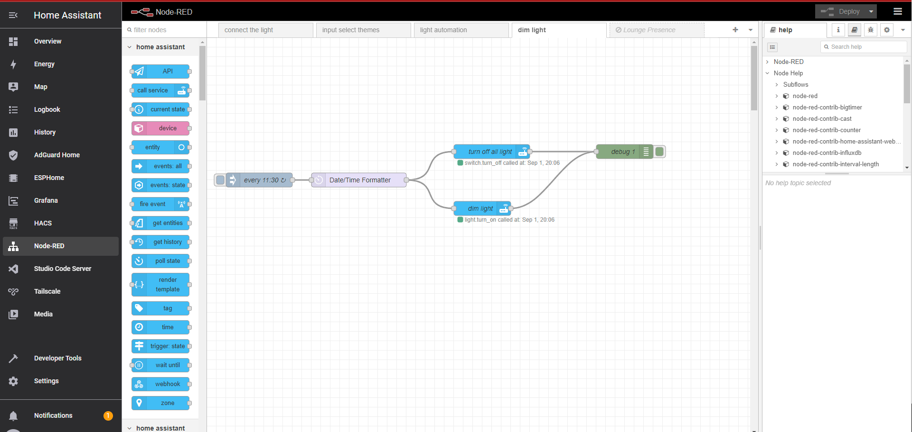

# Home Assistant Community Add-on: Node-RED

Flow-based programming for the Internet of Things.

## About

Here I collect all my code that I wrote to make it easier for everyone to use red-node

[:books: Read the full add-on documentation](https://github.com/hassio-addons/addon-node-red/blob/main/node-red/DOCS.md)

### Automation with Node-RED

**WARNING!** If you've never used Node-RED, [learn more by clicking here.](https://github.com/hassio-addons/addon-node-red)

We will create a flow in Node-RED to define the theme automatically every time you choose a theme in your interface. It's very simple! Just download the .json file or copy the code and paste it into the Node-RED import window.

### all Automation with Node-RED

